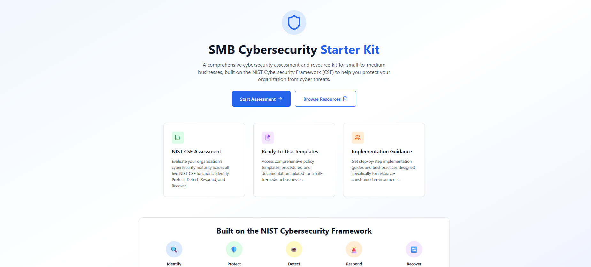
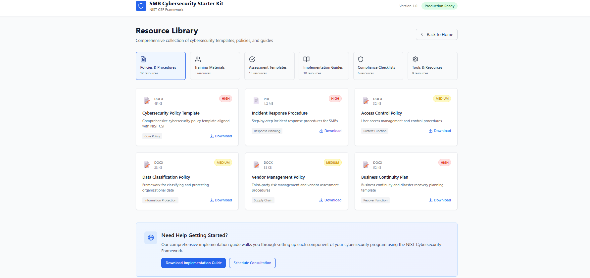
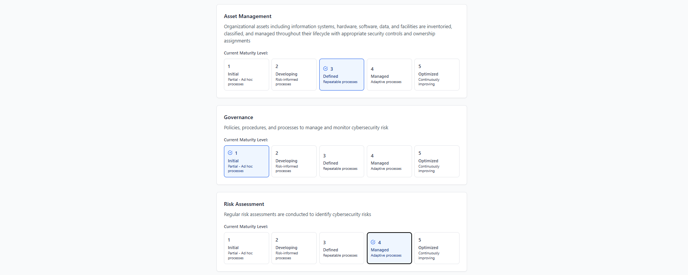

# SMB Cybersecurity Starter Kit

A comprehensive cybersecurity assessment and resource toolkit for small-to-medium businesses, built on the NIST Cybersecurity Framework (CSF). This application helps organizations evaluate their cybersecurity maturity and provides actionable recommendations for improvement.

## 🛡️ Features

- **NIST CSF Assessment**: Complete evaluation across all five framework functions (Identify, Protect, Detect, Respond, Recover)
- **Maturity Scoring**: Detailed scoring system with visual analytics and radar charts
- **Risk Assessment**: Automated risk level calculation based on current security posture
- **Actionable Recommendations**: Prioritized improvement suggestions with implementation guidance
- **Resource Library**: Comprehensive collection of policies, templates, and implementation guides
- **Professional Reporting**: Export capabilities for assessment results and compliance documentation

## 🎯 Target Audience

- Small-to-Medium Business (SMB) owners and managers
- Cybersecurity professionals and consultants
- GRC (Governance, Risk, and Compliance) analysts
- IT administrators implementing security frameworks

## 🚀 Technology Stack

- **Frontend**: React 18 with TypeScript
- **Styling**: Tailwind CSS
- **Charts**: Recharts for data visualization
- **Icons**: Lucide React
- **Build Tool**: Vite
- **Framework**: NIST Cybersecurity Framework (CSF)

## 📊 Assessment Categories

### Identify Function
- Asset Management
- Governance
- Risk Assessment
- Risk Management Strategy
- Supply Chain Risk Management

### Protect Function
- Access Control
- Awareness and Training
- Data Security
- Information Protection
- Maintenance
- Protective Technology

### Detect Function
- Anomalies and Events
- Security Continuous Monitoring
- Detection Processes

### Respond Function
- Response Planning
- Communications
- Analysis
- Mitigation
- Improvements

### Recover Function
- Recovery Planning
- Improvements
- Communications

## 🏗️ Installation and Setup

1. Clone the repository:
```bash
git clone https://github.com/yourusername/smb-cybersecurity-starter-kit.git
cd smb-cybersecurity-starter-kit
```

2. Install dependencies:
```bash
npm install
```

3. Start the development server:
```bash
npm run dev
```

4. Build for production:
```bash
npm run build
```

## 📈 Usage

1. **Start Assessment**: Begin with the comprehensive NIST CSF evaluation
2. **Complete Evaluation**: Answer questions across all five framework functions
3. **Review Results**: Analyze your organization's cybersecurity maturity scores
4. **Access Resources**: Download relevant templates and implementation guides
5. **Export Reports**: Generate professional assessment reports for stakeholders

## 🎨 Screenshots

### Welcome Screen

*Main landing page showcasing the NIST CSF assessment tool and resource library*

### Resource Library

*Comprehensive collection of cybersecurity templates, policies, and implementation guides*

### Assessment Interface

*Interactive assessment form for evaluating cybersecurity maturity across NIST CSF functions*

## 📋 Project Structure

```
src/
├── components/          # React components
│   ├── AssessmentForm.tsx
│   ├── Header.tsx
│   ├── ResourceLibrary.tsx
│   └── Results.tsx
├── types/              # TypeScript type definitions
│   └── assessment.ts
├── utils/              # Utility functions
│   └── assessment.ts
└── App.tsx            # Main application component
```

## 🔧 Configuration

The application uses a 5-point maturity scale:
- **1 - Initial**: Partial, ad hoc processes
- **2 - Developing**: Risk-informed processes
- **3 - Defined**: Repeatable processes
- **4 - Managed**: Adaptive processes
- **5 - Optimized**: Continuously improving processes

## 📚 Resources Included

- **Policies & Procedures**: 12 comprehensive templates
- **Training Materials**: 8 awareness and education resources
- **Assessment Templates**: 15 evaluation and tracking tools
- **Implementation Guides**: 10 step-by-step implementation resources
- **Compliance Checklists**: 6 regulatory compliance tools
- **Tools & Resources**: 9 technical implementation aids

## 🤝 Contributing

Contributions are welcome! Please feel free to submit a Pull Request. For major changes, please open an issue first to discuss what you would like to change.

## 📄 License

This project is licensed under the MIT License - see the [LICENSE](LICENSE) file for details.

## 🙏 Acknowledgments

- Built following NIST Cybersecurity Framework guidelines
- Designed for small-to-medium business environments
- Inspired by industry best practices and Security+ certification materials

## 📞 Contact

Created by Timothy Smith - smith.timothyh@gmail.com

Project Link: [https://github.com/smithtimothyh/smb-cybersecurity-starter-kit](https://github.com/yourusername/smb-cybersecurity-starter-kit)

---

**Note**: This tool is designed for educational and assessment purposes. For comprehensive cybersecurity implementation, consider consulting with qualified cybersecurity professionals.